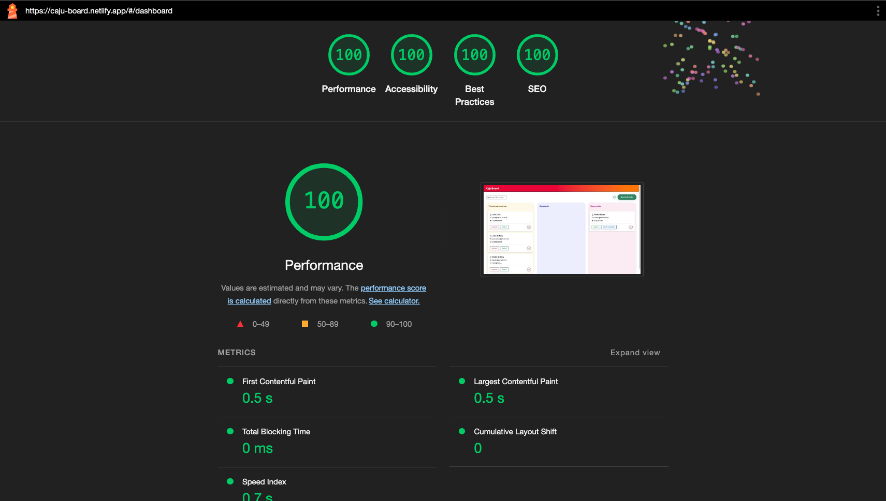
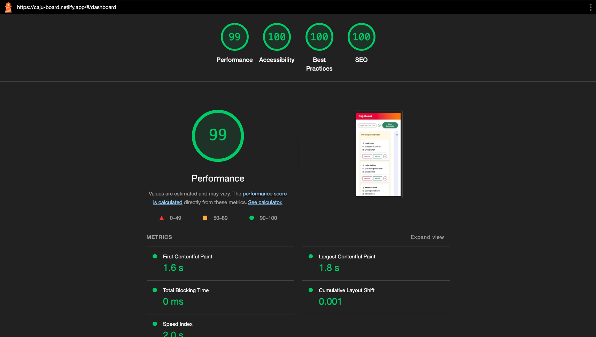

# CajuBoard

[](https://github.com/jarioneto/admission/actions/workflows/main.yml)
[](https://app.netlify.com/sites/caju-board/deploys)


Aplicação desenvolvida como avaliação para um desafio técnico.


Para acesso a aplicação utilizar o link a seguir [CajuBoard](https://caju-board.netlify.app).

Stack utilizada no desenvolvimento:
* TypeScript
* React
* Vite
* Cypress
* Jest
* React Testing Library
* ESlint
* Prettier
* CI/CD (Github Actions)
  * CI (**build, lint, test**)
  * CD (**Deploy to Netlify**)

O desenvolvimento foi guiado utilizando User centric metrics além de tópicos como acessibilidade, SEO e boas práticas, abaixo segue os reports do Lighthouse.






# Configuração inicial

Execute os passos abaixo para realizar a configuração inicial da aplicação.


### 1 - Variáveis de ambiente

Crie uma cópia do arquivo .env.example e e renomeie para .env

```bash
cp .env.example .env
```

Edite o arquivo criado no passo anterior e informe a URL da api

```bash
VITE_ADMISSION_API_URL="http://localhost:3000"
```


### 2 - Instalação das dependências

Para instalar as dependências da aplicação execute o comando abaixo:

```bash
yarn
```

# Scripts disponíveis

### Execução em modo de desenvolvimento

```bash
yarn dev
```

### Executar linter do código

```bash
yarn lint
```

### Criar build de produção

```bash
yarn build
```

### Executar testes unitários

```bash
yarn test:dev
```

### Executar testes E2E

```bash
yarn test:e2e
```

### Iniciar o JSON Server

```bash
yarn init:db
```
